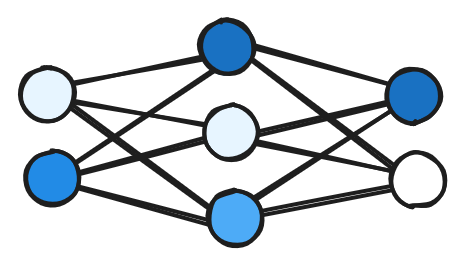
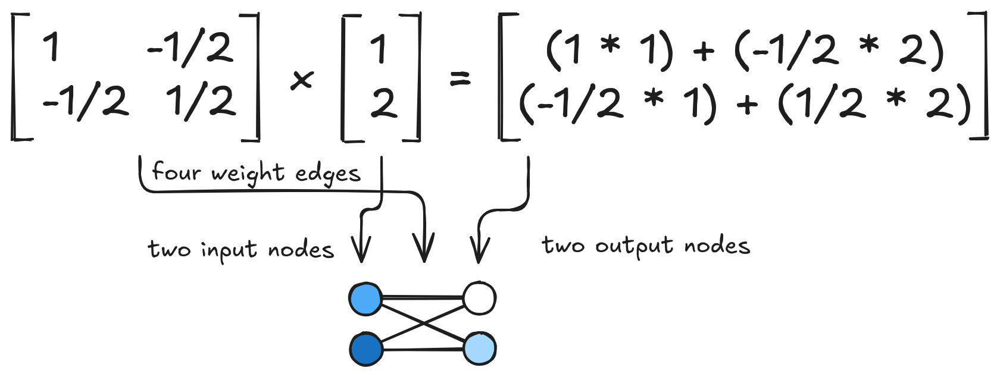
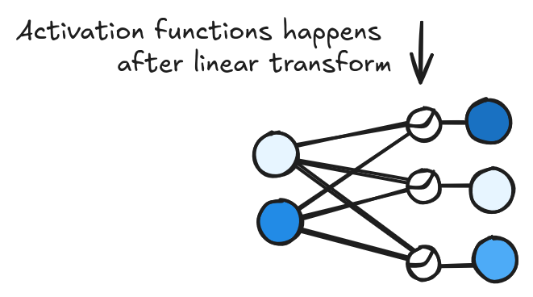

# Basics of Neural networks

{width=40% fig-align="center"}

## Vectors and Matrices

TODO: Write expanded descriptions for

- Vectors
- Matrices

TODO: [DIAGRAM SHOWING VECTORS AND MATRICES]

Large language models are complex, but they consist of two main
components. The first is vectors, or lists of numbers, and the other
is matrices, 'squares' of numbers. Pairs of vectors and matrices can
be combined with a multiplication-like operation. That operation goes
by different names, such as 'matrix multiplication' or 'linear
transformation'. There are many details about this operation that I
won't cover in this handbook. The study of matrix multiplication is a
key topic in linear algebra, if you'd like to learn more.

## Linear Transformations

The most important thing to understand about matrix multiplication
for neural networks is that it multiplies and combines each row of
the input vector to create a new output vector based on the matrix's
values. This is why you'll hear the matrices in neural networks
described as 'weights' or 'weight matrices.' Linear transformation
multiplies each entry in a vector by a corresponding weight and adds
those weighted entries to calculate the entry of the output vector.
This operation is shown in this diagram:

{fig-alt="Diagram of matrix multiplication and its relationship to the graph diagram that is often used."}

```{python}
# | echo: false
import plotly.io as pio
import plotly.graph_objects as go

pio.templates["custom"] = go.layout.Template(
    layout=dict(
        paper_bgcolor="rgba(0,0,0,0)",
        plot_bgcolor="rgba(0,0,0,0)",
        font=dict(family="EB Garamond", color="#2b2b2b"),
        xaxis=dict(gridcolor="#e0dbd4"),
        yaxis=dict(gridcolor="#e0dbd4"),
    )
)
pio.templates.default = "custom"
```
```{python}
import numpy as np

matrix = np.array([[1,   -1/2], 
                   [-1/2, 1/2]]) 

vector = np.array([[1],
                   [2]])

print(matrix @ vector)
```

## Activation Functions

Historically, activation functions were meant to mimic biological
neuron activation. But I tend to think of them now as a place that
the model can learn non-linear relationships that cannot be
represented in linear-transformations alone. Think of RELU as a kind
of 'hinge' in the function, that allows the function to follow
arbitrary curves.

{width=60% fig-align="left"}

```{python}
import torch
import plotly.express as px

activation = torch.nn.ReLU()
xs = torch.arange(-3, 3)
ys = activation(xs)

px.line(x=xs, y=ys, title="The ReLU function")
```

To see the 'hinge' behavior of ReLU in action, lets train a simple neural 
network to learn a function, f(x) = x³ - 3x² -x. 

```{python}
import torch.nn as nn
import numpy as np
import plotly.graph_objects as go
from plotly.subplots import make_subplots

DOMAIN = [-2, 4]

# If you keep the hidden dimension small the 'hinge' effect is more obvious
HIDDEN_SIZE = 8

model = nn.Sequential(
    nn.Linear(1, HIDDEN_SIZE), # These are linear transforms
    nn.ReLU(),
    nn.Linear(HIDDEN_SIZE, 1),
)

to_learn = lambda ins: ins ** 3 - 3 * ins ** 2 - ins

# Set a seed to make sure our 
torch.manual_seed(35)

xs = torch.FloatTensor(5000).uniform_(*DOMAIN).unsqueeze(1)
ys = to_learn(xs)

# Make a really simple model

optimizer = torch.optim.Adam(model.parameters(), lr=0.01)
loss_fn = nn.MSELoss()

for epoch in range(5000):
    pred = model(xs)
    loss = loss_fn(pred, ys)
    optimizer.zero_grad()
    loss.backward()
    optimizer.step()

# Now we can look at our model output

grid_xs = torch.arange(*DOMAIN, step=0.01).unsqueeze(1)
grid_ys = model(grid_xs).squeeze().detach().numpy()

graph_xs = grid_xs.squeeze().detach().numpy()
function_ys = to_learn(grid_xs).squeeze().detach().numpy()

fig = go.Figure()
fig.update_layout(title="ReLU acts like a hinge")
fig.add_trace(go.Scatter(x=graph_xs, y=function_ys, name="Actual"))
fig.add_trace(go.Scatter(x=graph_xs, y=grid_ys, name="Modeled"))
```

In this example the model can use ReLU to learn where to place a hinge to learn
the best approximation of a cubic polynomial. We kept the model pretty
constrained on the hidden layer dimensions to make the hinge points more
obvious. A linear transformation without the non-linearity could *only* create a
line through this example dataset.

### What is happening here exactly?

The next chart shows how each node in the hidden layer activates given a
particular x input. The most important features are the 'hinge' point and the
slope of the non-zero portion of the function. The arrows on the right show the
final hidden layer, multiplying each ReLU curve, which is then summed to obtain
the final output.

```{python}
#| code-fold: true
#| code-summary: "Show chart code"

sd = model.state_dict()
w = sd['0.weight'].squeeze().numpy()
b = sd['0.bias'].numpy()
x = np.linspace(-2, 4, 200)
w2 = sd['2.weight'].squeeze().numpy()

COLS = 2
ROWS = len(w) + 1

grid_xs = torch.arange(*DOMAIN, step=0.01).unsqueeze(1)
grid_ys = model(grid_xs).squeeze().detach().numpy()

graph_xs = grid_xs.squeeze().detach().numpy()
function_ys = to_learn(grid_xs).squeeze().detach().numpy()

ymin = min(np.maximum(0, w[i]*x + b[i]).min() for i in range(len(w)))
ymax = max(np.maximum(0, w[i]*x + b[i]).max() for i in range(len(w)))

funcmax = max(function_ys) * 1.1
funcmin = -funcmax

fig = make_subplots(
    rows=ROWS,
    cols=COLS,
    shared_xaxes=True,
    shared_yaxes=True,
    column_widths=[0.5, 0.05],
    row_heights=[150] * (ROWS - 1) + [300],
    vertical_spacing=0.03,
    horizontal_spacing=0.0,
)

fig.add_trace(
    go.Scatter(x=graph_xs, y=grid_ys, name="Modeled"),
    row=ROWS,
    col=1,
)

fig.add_trace(
    go.Scatter(x=graph_xs, y=function_ys, name="Actual"),
    row=ROWS,
    col=1,
)

for i in range(len(w)):
    y = np.maximum(0, w[i]*x + b[i])
    fig.add_trace(go.Scatter(x=x, y=y, mode='lines'), row=i+1, col=1)
    fig.add_trace(go.Scatter(
        x=[0,0],
        y=[0,w2[i]],
        marker={
            "symbol":[
                'circle', 
                'triangle-up' if w2[i] > 0 else 'triangle-down'
            ], 
            "size": [0, 10],
            "color": "black"
        },
    ), row=i+1, col=2)

    knot_point = (-b[i]/w[i])
    if (-2 <= knot_point <= 4):
        fig.add_vline(x=knot_point, row=i+1, col=1, line_dash="dot")
        fig.add_vline(x=knot_point, row=ROWS, col=1, line_dash="dot")

fig.update_yaxes(range=[-max(w2) * 1.1, max(w2) * 1.1], col=1)
fig.update_yaxes(range=[funcmin, funcmax], row=ROWS)
fig.update_yaxes(showticklabels=False)
fig.update_yaxes(visible=False, col=2)
fig.update_xaxes(visible=False)

fig.add_annotation(
    text="Model output for each neuron (one linear transform & ReLU)", 
    x=-0.07, y=0.87, xref='paper', yref='paper',
    showarrow=False, textangle=-90, font=dict(size=14),
)
fig.add_annotation(
    text="Combination", x=-0.07, y=0.0, xref='paper', yref='paper',
    showarrow=False, textangle=-90, font=dict(size=14),
)

fig.add_annotation(
    text="Layer two (multiplies the model output before combination)", 
    x=1.05, y=0.87, xref='paper', yref='paper',
    showarrow=False, textangle=-90, font=dict(size=14),
)

fig.update_layout(
    margin={"l": 40, "r": 40, "t": 50, "b": 10},
    height=750,
    width=500,
    showlegend=False,
    title="How ReLUs compose into an arbitrary function"
)

```

## The GELU Activation Function

An improvement on ReLU, is GELU which is very similar but is smooth through zero 
where ReLU has a corner.

```{python}
activation = torch.nn.GELU()
xs = torch.arange(-3, 3, step=0.1)
ys = activation(xs)

px.line(x=xs, y=ys, title="GELU")
```

## Ring Example

To show the GELU function in action, let's create a model that learns from
two-dimensional input instead of one in our polynomial example.

Let's create a simple task for the model to complete. We'll have a
two-dimensional space with a 'ring' and we'll have the model learn whether new
points fall into that ring.

```{python}
import plotly.graph_objects as go
import numpy as np

t = np.linspace(0, 2*np.pi, 100)
fig = go.Figure()

for r in [1, 2]:
    fig.add_trace(
        go.Scatter(
            x=r*np.cos(t),
            y=r*np.sin(t),
            mode='lines',
            line={"color": "#636EFA"},
        ),
    )

xs = torch.FloatTensor(1000, 2).uniform_(-3,3)
radii = (xs * xs).sum(axis=1).sqrt()

zs = (radii > 1) & (radii < 2)

fig.add_trace(
    go.Scatter(
        x=xs[:,0].numpy(),
        y=xs[:,1].numpy(),
        mode="markers",
        marker={
            "color": zs.int().numpy(),
            "colorscale": [[0, "#EF553B"], [1, "#636EFA"]],
        },
    )
)

fig.update_layout(
    xaxis={"range": [-3,3]}, 
    yaxis={"range": [-3,3], "scaleanchor": "x"},
    showlegend=False,
)

```

[3D Diagram of a learned model that shows the GELU hinge instead of the ReLU
hinge]

## Normalization functions

Normalization functions are the final major component of neural networks. As a
value gets multiplied and added again and again through layers of a network, the
values can get very big or very small. So much so that the computer hardware can
no longer store the value correctly. Normalization functions apply an operation
to a vector to keep those overflows from happening.

These basic components are combined to make almost all neural network models
from really simple multi-layer perceptrons, to large language models.

A basic neural network architecture arranges these components in layers. A 'layer' 
consists of a linear transformation and an activation function together. Several 
of these layers together can learn very complex non-linear relationships.

So far, and below we have talked about how a model calculates an output thorugh
these operations. We haven't yet covered how the models are 'trained' to ensure
the model is generating 'good' outputs through these calculations. This
explainer doesn't go into detail about how the models are trained. I find that
the easiest way to think about it is that model designers write the forward
pass, write the loss function, and the automatic differentiation system takes care
of *back propagation*, the process of updating all model parameters to lower the
loss (EDIT: JARGON). The main task that the model learns during training
is to predict the next token given the previous tokens in the sequence.

## Vectors are arrows in space

### Visualizing Linear transformations of vectors

### Activation functions make linear transformations non-linear


